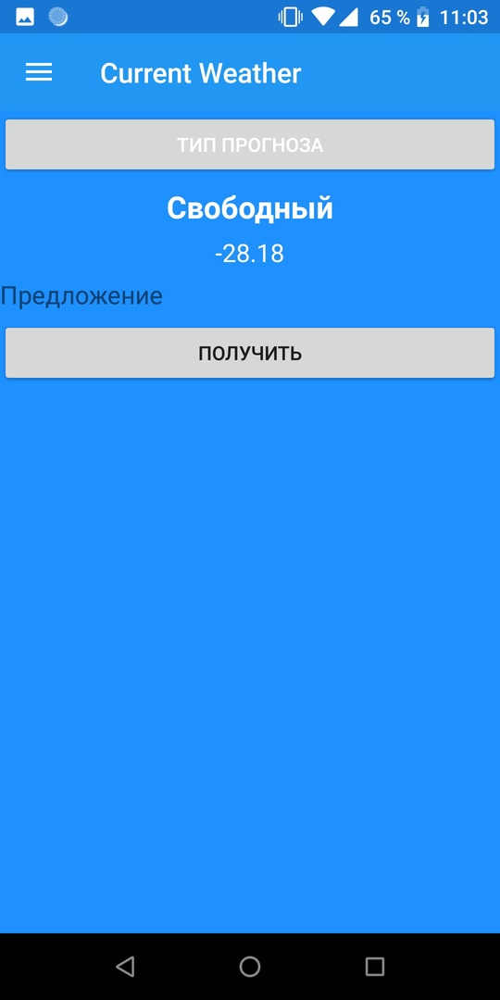

Название проекта: Погодное приложение

Цель: Создать приложение для Андройд.

Используемые технологии: Xamarin и Xamarin.Forms, библиотеки для них. API OpenWeatherMap.com

Системные требования: Минимальная версия - Android 4.1 Jelly Bean; Целевая - Android 8.1 Oreo

Функциональность: 

1) Текущая погода;

2) Погода на 7 дней.

Параметры погоды: 

1) Градусы в Цельсиях(Реализовано)

;
                  
2) Атм. давление(Не реализовано);
                  
3) Скорость ветра(Не реализовано);
                  
4) Направление ветра(Не реализовано);
                  
5) Облачность (Не реализовано).

Установка: 

1) Скачать .apk файл приложения;
           
2) Разрешить установку приложений из неизвестных источников(Настройки - Безопасность) или при запуске дать разрешение на установку;
           
3) Запустить .apk файл проекта.
